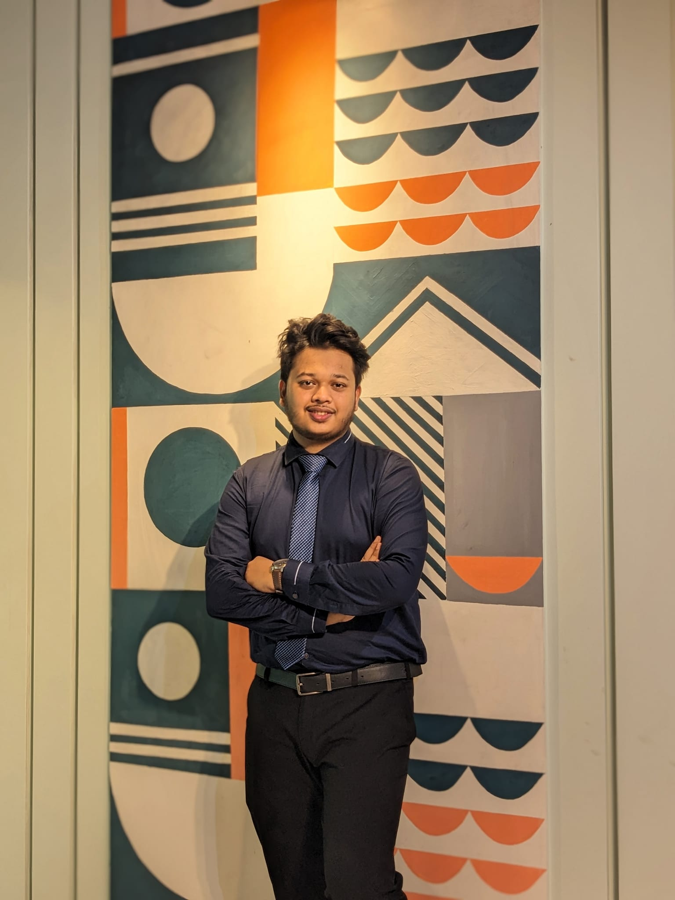

# Hi I'm Md Mohibbul Haque Chowdhury 

## 👨‍💻 About Me

⚡ Electrical and Electronic Engineering graduate from **Rajshahi University of Engineering & Technology (RUET)**.  
🎓 Currently pursuing **MSc in Electrical & Electronic Engineering** at **BRAC University**.  
🔬 Research-focused learner interested in **Power System Stability, Renewable Energy Integration, EV Charging Impact on Grid, and Biomedical Engineering**.  
📊 Experienced in MATLAB/Simulink-based simulation, power electronics, Arduino-based embedded systems, signal processing, and machine learning applications.  
📚 Passionate about academic research, teaching, engineering problem-solving, and developing simulation-based electrical system models.  

 

## 🎯 Research Interests

- ⚡ Power System Stability  
- 🌱 Grid Integration of Renewable Energy  
- 🚗 EV Charging Impact on Power Distribution Networks  
- 🔌 Power Electronics & Inverter-Based Systems  
- 🧠 Biomedical Signal Processing  
- 🤖 Machine Learning Applications in EEE  

---

## 🛠️ Skills & Tools

### Programming & Data Analysis

### Simulation & Engineering Tools

### Machine Learning & Visualization

---

## 🚀 Featured Academic Projects

### ⚡ [Power System Transient Stability of Synchronous Machine using MATLAB](https://github.com/MHChowdhury179/power-system-transient-stability-matlab-)
- Analyzed transient stability of a synchronous machine connected to an infinite bus.
- Applied swing equation and equal area criterion for stability assessment.
- Calculated critical clearing angle and critical clearing time under different fault conditions.

### 🔌 [Three-Phase Inverter & Hysteresis Control of Grid-Connected Single-Phase Inverter](https://github.com/MHChowdhury179/three-phase-inverter-hysteresis-control-simulink)
- Developed MATLAB/Simulink models for inverter-based power electronics systems.
- Analyzed inverter output voltage, current, reference signal, gate pulses, and switching behavior.
- Studied hysteresis control technique for grid-connected inverter operation.

### ⚙️ [SCR Class B & C Commutation: Experimental & Simulink Analysis](https://github.com/MHChowdhury179/scr-class-b-class-c-commutation-circuits)
- Implemented SCR-based Class B and Class C commutation circuits.
- Compared experimental oscilloscope waveforms with MATLAB/Simulink simulation results.
- Analyzed SCR turn-off characteristics and forced commutation behavior.

### 🏭 [PLC Logic Simulation and Motor Control using LOGO! Soft Comfort and OMRON PLC Trainer](https://github.com/MHChowdhury179/logo-soft-comfort-omron-plc-trainer)
- Designed and tested PLC ladder logic for motor control applications.
- Simulated start-stop operation, interlocking, and timer-based industrial control systems.
- Worked with LOGO! Soft Comfort and OMRON PLC Trainer.

### 🌡️ [DC Motor Speed Control using Temperature Sensor](https://github.com/MHChowdhury179/dc-motor-speed-control-temperature-sensor)
- Developed an Arduino-based DC motor speed control system using PWM.
- Used temperature sensor input to control motor speed dynamically.
- Verified PWM duty cycle and motor response through waveform observation.

📌 **More projects are available on my [GitHub](https://github.com/MHChowdhury179).**

---

## 📄 Publication

- **ECG-Based Stress Prediction with Power Spectral Density Features and Classification Models**  
  *M. H. Chowdhury, N. Anjum, M. R. Mim*  
  **2nd International Conference on Quantum Photonics, Artificial Intelligence, and Networking (QPAIN), IEEE, 2026**
Status:Accepted.
---

## 🔬 Research Experience

### Graduate Research — BRAC University  
**Topic:** Hosting Capacity Analysis of Power Distribution Networks  
**Supervisor:** Professor Tareq Aziz  
- Studying voltage stability limits under high distributed generation penetration.
- Developing load flow models to evaluate voltage profiles and network constraints.
- Performing simulation-based hosting capacity assessment for renewable energy integration.

### Undergraduate Thesis — RUET  
**Topic:** Stress Prediction Using CNN and LSTM from ECG Signals  
**Supervisor:** Assistant Professor Kusum Tara  
- Developed computational models for ECG signal processing and stress prediction.
- Applied Python-based data analysis, model validation, and performance comparison.
- Worked with CNN and LSTM models for biomedical signal classification.

---

## 🎓 Education

- **MSc in Electrical & Electronic Engineering**  
  BRAC University | Ongoing  
  Expected Completion: 2027  

- **BSc in Electrical & Electronic Engineering**  
  Rajshahi University of Engineering & Technology (RUET) | 2019–2024  

- **Higher Secondary Certificate**  
  Notre Dame College, Dhaka | 2017-2018

- **Secondary School Certificate**  
  Motijheel Govt. Boys’ High School | 2006-2016

---

## 🏅 Awards & Recognition

- 🏆 **Leadership Award 2020–2023** — Department of EEE, RUET  
- 🥈 **2nd Runner Up, Poster Presentation 2023** — Role of ICT for 4th Industrial Revolution at RUET  
- 🎓 **Scholarship, HSC/A Level** — 432nd Position in Dhaka District  
- 🎓 **Scholarship, SSC/O Level** — 119th Position in Dhaka District  
- 🧪 **Creative Talent Hunt Champion** — Science, Dhaka Mohanagar Region  

---

## 💼 Professional Experience

### Bangladesh Power Development Board (BPDB)

**Industrial Trainee — Ghorashal Power Station** | March 2023
**Certificate:** [View Certificate](https://github.com/MHChowdhury179/MHChowdhury179/blob/606c9197d60177ef1f9fa1a5faff572f172e9d80/Attachment.pdf)

* Assisted operations and maintenance teams across generation and distribution systems.
* Observed DCS monitoring, steam turbine operation, and water treatment systems.
* Inspected protection devices and relay configurations.

---

## 🌱 Extracurricular Activities

- **HULT Prize at RUET, Bangladesh**  
  Mentor | Apr 2023 – May 2024  
  Director, Administrative & Human Resource | Oct 2022 – Feb 2023  

- **TEDxRUET**  
  Organizer | Jan 2022 – Mar 2022  

- **IEEE RUET Student Branch, Bangladesh**  
  Logistic Co-ordinator | Aug 2020 – Dec 2022  

---

## 📫 Connect with Me

- 📧 Email: **efazc05@gmail.com**
- 🔗 LinkedIn: [linkedin.com/in/mhcefaz](https://linkedin.com/in/mhcefaz)
- 💻 GitHub: [github.com/MHChowdhury179](https://github.com/MHChowdhury179)

---

⭐ *Thanks for visiting my GitHub profile!*
